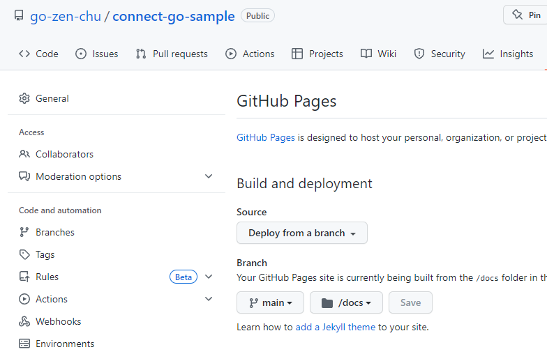

# connect-go-sample

Ref: [Getting started | Connect](https://connect.build/docs/go/getting-started/)

Connect を利用すると、HTTPとgrpcサーバの両方ができる。

## install tools

```bash
go install github.com/bufbuild/buf/cmd/buf@latest
go install google.golang.org/protobuf/cmd/protoc-gen-go@latest
go install github.com/bufbuild/connect-go/cmd/protoc-gen-connect-go@latest

# not nessary when you only try http endpoint
go install github.com/fullstorydev/grpcurl/cmd/grpcurl@latest
```

## create protobuf schema

```bash
touch ./greet/v1/greet.proto

# use buf command to generate source code from schema
buf mod init
buf generate
```

## generate docs

```bash
# install protoc command
# mac
brew install protobuf
# install plugin
go install github.com/pseudomuto/protoc-gen-doc/cmd/protoc-gen-doc@latest
protoc --doc_out=./docs --doc_opt=html,index.html **/*.proto
```

Set GitHub pages.


